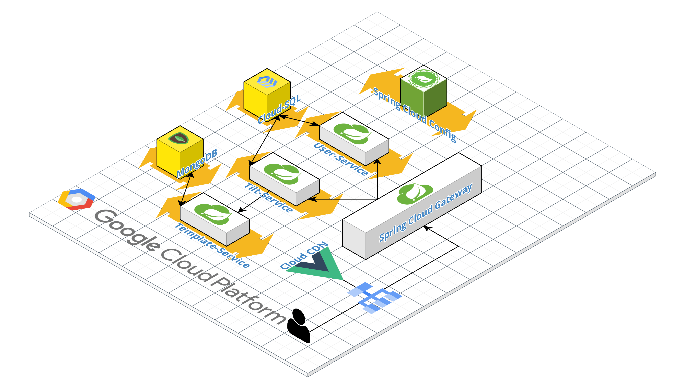
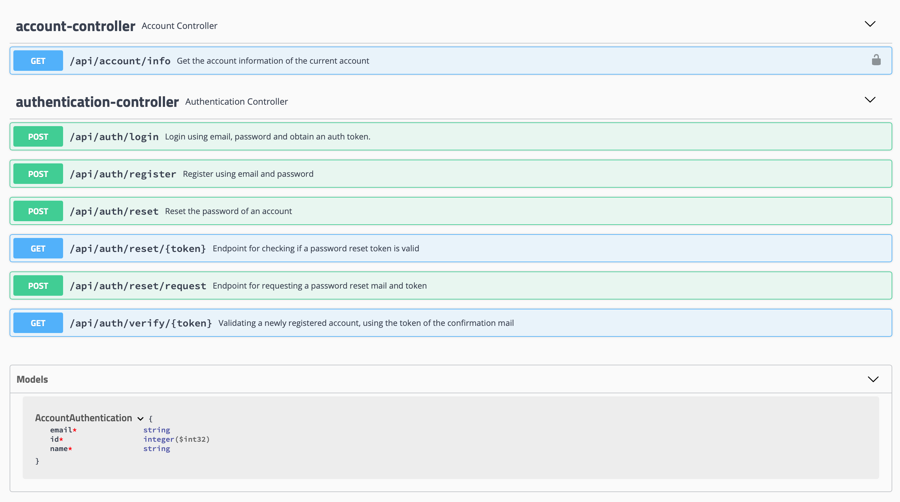
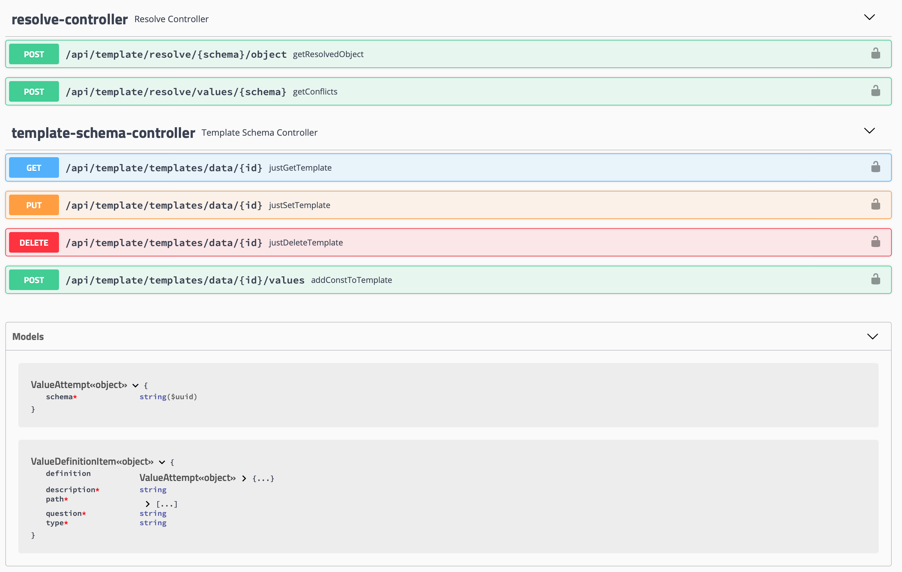
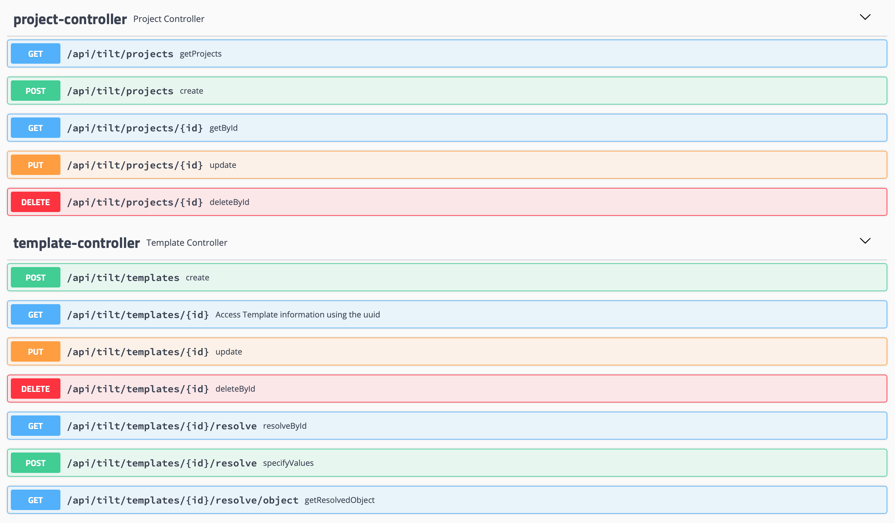
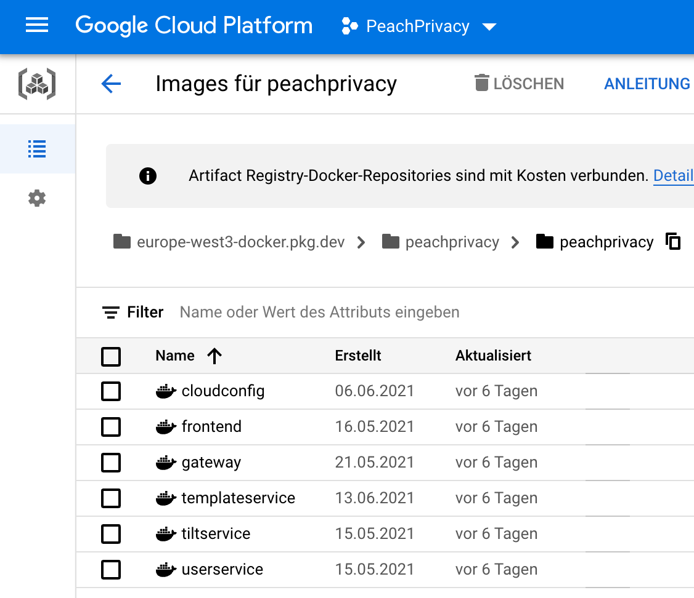
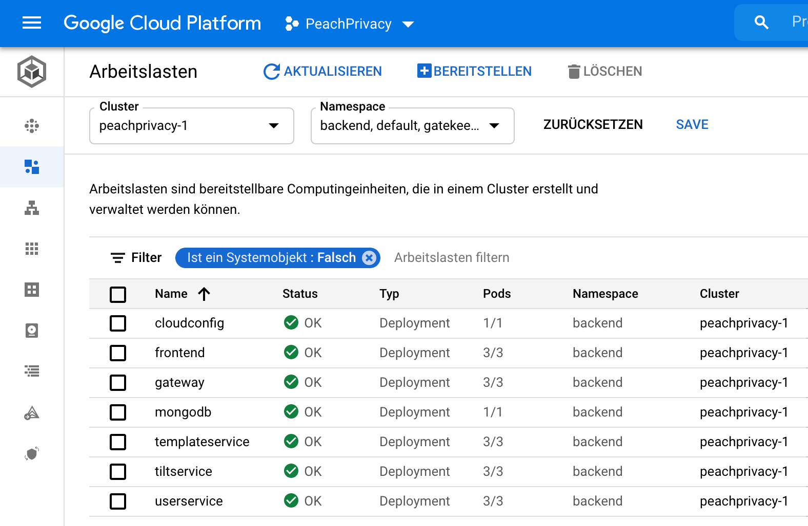
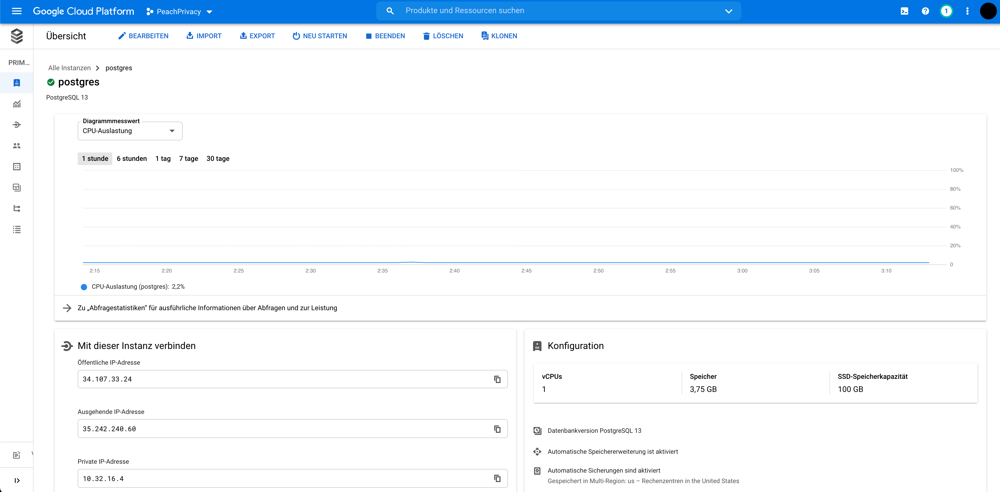
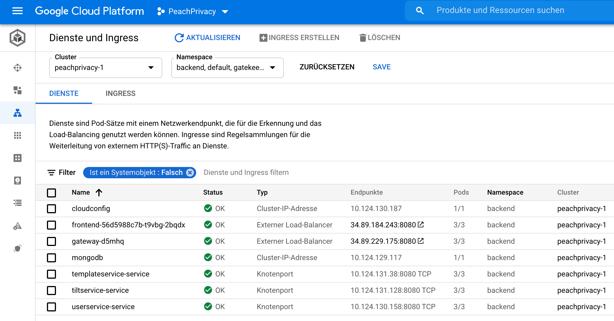
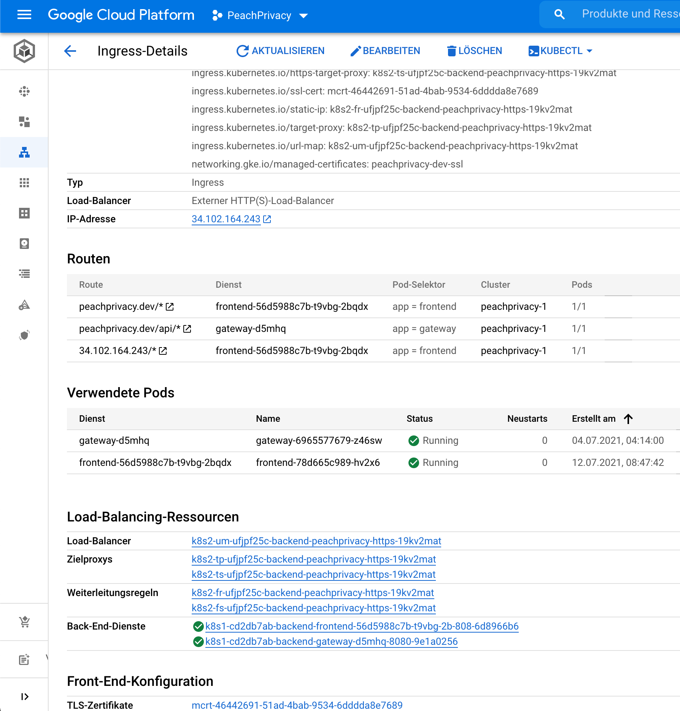

# PeachPrivacy Technical Report

Submitted by Lisa Annett Barthel, Samy Abdellah Hamdad,
Patrick Wolfgang Hein und Paskal Paesler

# Projektorganisation

Dass die Koordination und Kommunikation innerhalb eines Teams eine große
Rolle spielen, sollte keine große Überraschung sein. Dafür hat das Peach Privacy Team den Dienst Trello verwendet. Das Trelloboard ist ein typisches Werkzeug für die agile Entwicklung und ermöglichte es uns die Aufgaben asynchron an die Teammitglieder zu verteilen. Außerdem hatten wir so die Möglichkeit uns gegenseitig zu signalisieren, wenn Aufgaben blockiert waren oder endlich begonnen werden konnten. Durch die schrittweise Verfeinerung der Aufgaben gelang es uns das Gesamtsystem besser zu strukturieren. Trello verwaltet unsere Boards zu den Themen Frontend, Backend und Folien. Im Bereich der Folien wurden unsere Zuarbeiten für die Vorbereitung auf Zwischenpräsentation und Abschlusspräsentation im Rahmen unseres Projektes verwaltet. Mittels virtueller Meetings haben wir uns für die jeweiligen Präsentationstermine abgestimmt und letzte Anpassungen vorgenommen. Auf dem Backendboard verwalteten wir alle Teilaufgaben, die im Backend angefallen sind. Sei es Userservice, Tiltservice oder auch Templateservice. Alles war dort zu finden. Ein weiteres Board war unser Frontendboard. Für unsere Entwicklung war es wichtig klar zu strukturieren, welche Aufgaben bezüglich der GUI alles zu erfüllen sind. Ob Bestandteile der Landingpage oder die konkreten Formulare. Wer sich um welche Funktionalität aktuell kümmert oder was noch offen ist, alles wurde auf unserem Board
verwaltet. Dafür ermöglicht Trello eine einfache Erstellung von Aufgaben und Zuweisung von Teammitgliedern zu diesen Aufgaben. Eine Änderung des Bearbeitungszustands ist dabei so einfach wie nur möglich: Verschieben von einzelnen Aufgaben in unterschiedliche Bereiche bietet einen klaren Überblick.

Aber ein Tool zur Entwicklung einer kooperativen Projektverwaltung ist doch nicht das Einzige, was bei der Entwicklung eines solchen Projektes benötigt wird. Für die Sicherung des Programmcodes sowie die gemeinsame Arbeit an diesem war uns auch noch ein weiteres Tool eine große Hilfe: Git. Besonders der Umgang mit Featurebranches war für uns zum Teil eine neue, aber sinnvolle Erfahrung. Durch die Erstellung von einzelnen Branches, die nur für die Entwicklung von ganz spezifischen Bausteinen oder für die Lösung von Problemen wie der Reset eines Passwortes im Rahmen der Benutzerverwaltung verwendet werden. Erst wenn sichergestellt ist, dass der entwickelte oder korrigierte Code tatsächlich funktioniert, wird er ins Gesamtprojekt eingefügt und auf unserer offiziellen Webseite: https://peachprivacy.dev veröffentlicht.

# Architektur

Da das Ziel dieses Projekts das Hosten von Tilt-Dokumenten ist, lag unser Fokus darin eine möglichst hohe **SLA** (**S**ervice-**L**evel **A**greement und dementsprechend eine möglichst hohe Uptime zu erzielen. Um die Ausfälle seitens des Server-Hosters zu minimieren haben wir die **Google Cloud Platform** als Cloud Provider gewählt. Zusätzlich war es bei der Entwicklung wichtig die ganze Applikation skalierbar zu gestalten, um auch bei vielen Anfragen die SLA einzuhalten.

Wir haben mithilfe von Spring Cloud eine Microservice-Architektur realisiert, welche sich aus fünf Services zusammensetzt und via REST mit HTTP/2 kommuniziert.

## Services

### UserService

Der UserService ist für user-bezogene Aktionen wie beispielsweise die Registrierung oder das Anmelden via. JWT verantwortlich.

[http://35.246.192.209:30000/swagger-ui.html](Swagger, direkt auf Service)

[https://app.swaggerhub.com/apis/p4skal/peachprivacyuserservice/1.0](SwaggerHub)

### TemplateService

Der TemplateService ist sowohl für das Abspeichern der Tilt-Schemas in **MongoDB**, als auch für das Rendern von Vererbungshierarchien zwischen ein oder mehreren Tilt-Schemas zu einem Tilt-Dokument verantwortlich.

[http://35.246.192.209:30002/swagger-ui.html](Swagger, direkt auf Service)

[https://app.swaggerhub.com/apis/p4skal/peachprivacytemplateservice/1.0](SwaggerHub)

### TiltService

Der TiltService verwaltet die Metadaten der Projekte. Hier wird die Referenz der Tilt-Schemas zum TemplateService gespeichert. Ebenfalls befinden sich hier die entscheidenen Endpunkte zum Erstellen und Modifizieren von Projekten, als auch zum Rendern und Validieren von diesen. Dieser Service wird im Gegensatz zum TemplateService nach außen bereitgestellt, da hier eventuell redundante Informationen die der Template Service benötigt vorhanden sind.

[http://35.246.192.209:30001/swagger-ui.html](Swagger, direkt auf Service)

[https://app.swaggerhub.com/apis/p4skal/peachprivacytiltservice/1.0](SwaggerHub)

### Andere

Neben den aufgelisteten Services gibt es noch einige Bestandteile, welche Spring Cloud benötigt.

**Spring Cloud Config** verwaltet die zentrale Konfiguration von allen Microserivces. Optional könnte man hier eine `application.properties` von einem ObjectStorage oder Git-Repository abrufen und während der Laufzeit synchronisieren (**IaC**, **I**nfrastructure **a**s **C**ode). Zusätzlich beinhaltet der ConfigService eine Service Registry, bei welcher sich alle anderen Services registrieren. Dies ermöglicht sowohl Client-Side Load Balancing als auch das Auflösen der entsprechenden Cluster IPs, welche wir zur internen Kommunikation verwenden. Zusätzlich wären damit beispielsweise Features wie Circuit Breaker oder das Sammeln von Metriken und das Monitoring möglich. Als Service Registry haben wir **Eureka** gewählt, da sich damit sowohl die Production Environment in der Cloud als auch die Development Environment lokal sehr gut realisieren lässt. Bei einem Ausbau wäre hier denkbar **Kubernetes** selbst als Service Registry zu verwenden.

**Spring Cloud Gateway** ist als Edge Server im Microservice-Framework präsent und übernimmt als Reverse Proxy das Weiterleiten der HTTP Requests zu den entsprechenden Services. Außerdem validiert es ggf. via Cloud Security JWT Tokens.

Um das volle Potential von Spring Cloud und die damit verbundenen Vorteile zu nutzen, müsste man mehr Komponenten implementieren.

## Dependencies

Das gesamte Backend wurde in **Kotlin** programmiert, da wir so komplexe Abläufe mit relativ wenig Zeilen Code abbilden konnten. Als Build Management Tool haben wir **Gradle** im Kotlin-Syntax genutzt, damit ein **Multi-Module** Projekt erzeugt und den entsprechenden Modulen die benötigten Dependencies bereitgestellt. Für das Web-Modul von Spring haben wir beispielsweise in einigen Modulen **Spring Boot WebFlux** verwendet und in anderen **Spring Boot Web MVC**. Für die Postgre-Datenbank haben wir **Spring Boot Data JPA** (mit Hibernate) verwendet, was jedoch teilweise das Reactive Programming Paradigma, vorgegeben von Spring Boot Webflux / Project Reactor einschränkt. Für Unit Tests bzw. Integration Tests, welche in diesem Projekt weitestgehend vernachlässigt wurden, haben wir H2 als In-Memory SQL Database verwendet. Dokumentation wie beispielsweise KDoc wurde in diesem Projekt ebenfalls vernachlässigt. Lediglich Swagger wurde zur Visualisierung der Endpunkte für die Entwicklung des Frontends verwendet.

Das Frontend wurde mit **Vue** realisiert und zusätzlich um das *Vue Material Kit* von [https://creative-tim.com](Creative Tim) erweitert. Hier wird mithilfe einer **Dockerfile** das Frontend containerized.

Authentication, sprich das Validieren der Zugriffserlaubnis eines Clients, wird mit **JWT** (**J**SON **W**eb **T**oken) realisiert, welches als Bearer Token im Authorization Header des HTTP-Protokolls für jede geschützte Anfrage mitgegeben wird. Falls der Token präsent und valid ist, wird dieser von Spring Cloud Gateway geparsed und die nötigen Informationen werden per HTTP-Header an die Microservices geschickt. Hier wird das Authentication Module relevant, welches als Library für Microservices verwendet wird. Dieses setzt ein Authentication Objekt mit den übergebenen Informationen in Spring Security. Authorization, die entscheidet wer welchen Zugriff hat, übernehmen somit die Microservices via Spring Security selbst. Authentification, sprich das Ausstellen der Tokens übernimmt der UserService. Hierfür werden Informationen wie die E-Mail, die Rolle, sowie andere Daten in ein JWT-Token gepackt, signiert und an das FrontEnd als Antwort zurückgegeben.

Der Source Code von PeachPrivacy wird in einem GitHub Cloud Repository gehostet und via **Feature Branching** verwaltet. Beim Mergen eines Feature Branches auf den Master Branch werden **GitHub Actions** ausgelöst, mit welchen wird **CI/CD** realisieren. Für jeden Service wird ein OCI-Image gebaut, welches anschließend in die **Google Artifact Registry** deployed wird.

Für das Hosten der einzelnen Services haben wir die **Google Kubernetes Engine** mit Autopilot verwendet, was uns eine sekundengenaue Abrechnung der tatsächlich verbrauchten Leistung der Pods ermöglicht. Jeder Service, sprich jedes Image wurde in ein Kubernetes Deployment konfiguriert und mit einem Horizontal Pod Autoscaler, welcher anhand des CPU-Kriteriums skaliert versehen. Um Continuous Availability zu erreichen hat jeder Service bis auf Spring Cloud Config eine Replica-Count von mindestens 3. Bei Spring Cloud Config ist aufgrund von Eureka und der komplexen Master-Master Replikation ein Single Point of Failure möglich. Dieses Problem wäre durch Kubernetes als Service Registry einfach beheben. MongoDB läuft momentan noch mit einer Instanz, obwohl es einen Gedanken wert wäre hierfür den offiziellen Helm Chart zu installieren.

PostgreSQL wird via. **Cloud SQL** von GCP bereitgestellt, interessant wäre hier der Wechsel auf eine NewSQL-Datenbank wie z.B. Cloud Spanner.

Das FrontEnd läuft momentan noch als normales Deployment mit dem NPM-Package `http-server`.

Mit Hilfe von **Kubernetes Ingress** wird sowohl das von Google Cloud DNS kommende SSL-Zertifikat vor jede Anfrage / Antwort positioniert, als auch zwischen FrontEnd und Spring Cloud Gateway verteilt. Um eine bessere Uptime zu erreichen könnte man das FrontEnd über ein CDN anbieten und anstelle von Kubernetes Ingress den Layer 7 LoadBalancer von GCP verwenden.

# Algorithmus

## Problemstellung

Zur kurzen Auffrischung der Idee hinter PeachPrivacy / TaaS: Unternehmer, welche Tilt für ihre Website verwenden möchten, haben momentan keine einfache Möglichkeit, ein Tilt-Dokument als JSON-Datei zu erstellen - Manche dieser Unternehmer wissen vielleicht gar nicht, dass es JSON oder gar Tilt gibt; Ziel ist es für sie, eine Möglichkeit zur besseren Visualisierung ihrer Transparenzerklärung bzgl. der DSGVO zu haben.
Dazu kommt noch, dass einem die darin verwendeten Wörter wie "Controller" nicht unbedingt etwas sagen. Holt man einen Anwalt heran, um die Begriffe zu klären, kommt wieder das JSON-Problem zum Vorschein - nicht alle Anwälte beherrschen JSON.

Zusammengefasst: Es ist kompliziert, an eine einfache Darstellung von Datenschutzerklärungen zu kommen, obwohl Tilt und die Dokumentation öffentlich zugänglich sind, da es für viele Zielpersonen zu schwierig ist, die Vorraussetzungen dahinter zu verstehen. Diese Lücke gehen wir an.

Um es dem Unternehmer noch mehr zu vereinfachen, Tilt-Dokumente zu erstellen, hatten wir außerdem die Idee, Fragen branchenspezifisch anzubieten. Hier ist eine Kernziel für das Verständnis des weiteren Textes wichtig: **Am Ende entsteht trotz möglicherweise verschiedener Fragen immer ein Tilt-Dokument.**

Die daraus resultierende Idee: **Objektorientierte Formulierung der Fragen**. Wie ist das zu verstehen?
Jeder Fragebogen ist in der Lage, neue Fragen zu formulieren, allerdings auch alte zu beantworten, möglicherweise mit einer Antwort von einer der neuen Fragen. Dasselbe Konzept trifft auf Subklassen zu: Zusätzliche Attribute lassen sich frei deklarieren und sowohl die eigenen als auch die der Superklassen definieren - ggf. via Referenz zu einem anderen Attribut. Fragen entsprechen in diesem Konzept Attribute, die deklariert, allerdings nicht definiert sind. Ein Beispiel:
Fragebogen A hat eine Frage: "Beschreiben Sie ihr Auto". Fragebogen B ist speziell für Audi-Auto-Besitzer angepasst und beantwortet die Frage (vereinfacht, special characters ex.): "Audi mit der Lackfarbe +farbe+". Zusätzlich deklariert Fragebogen B das Attribut "farbe", wodurch der Nutzer von Fragebogen B nur noch beantworten muss, welche Farbe sein Auto hat.

Tilt ist allerdings keine Programmiersprache, ein fertiges Dokument entspricht einem JSON-Objekt. Objektorientierung behalten wir also vorerst im Hinterkopf - JSON selbst unterstützt sie nicht, dafür wurde die Notation nicht entwickelt.

Wie wird vorgegeben, wie Tilt auszusehen hat? Wie wird sichergestellt, dass ein JSON-Objekt, die erstellt wird, auch wirklich ein valides Tilt-Dokument ist? Hierzu wird JSON Schema genutzt: [https://github.com/Transparency-Information-Language/schema/blob/master/tilt-schema.json](Tilt-Schema). JSON Schema ist "ein Vokabular, welches JSON Dokumente annotieren und validieren kann" ([https://json-schema.org/](json-schema.org)).

Bei JSON Schema handelt es sich allerdings NICHT um eine Validierungstechnik mit direkter Unterstützung für Objektorientierung. Es gibt einige Features, welche den Eindruck machen, als würden sie Objektorientierung anbieten, jedoch ist bspw. das Überladen von Validierungen nicht einfach bzw. nicht "echte" Objektorientierung - das ist allerdings eine Vorraussetzung (siehe Beispiel Audi).

Für mehr Info über die Problematik mit JSON Schema Objekt-Orientierung empfiehlt sich dieser [https://stackoverflow.com/a/63497112](StackOverflow-Post).

Wir brauchen also einen Fragebogen, und JSON Schema stellt die Fragen in Form von Anforderungen. Der letzte Schritt, um das Konzept zusammenzubringen, ist die Antworten zu hinterlegen. Dafür gibt es eine unseres Wissens nach grundsätzlich neue Lösung - die Herleitung von Werten aus Konstanten in JSON Schema.

JSON Schema erlaubt es, Werte mit Enums zu validieren. Nutzt man einen einzigen Enum-Wert, gibt man quasi eine Konstante vor, wodurch ein bestimmtes Feld in einem JSON-Objekt diesem Wert entsprechen muss. Das man so Konstanten definieren kann, wird ab [https://json-schema.org/understanding-json-schema/reference/generic.html#constant-values](Draft 6) als das Keyword "const" in JSON Schema als syntaktischer Zucker angeboten. Die grundsätzlich neue "Lösung" ist eigentlich lediglich eine triviale Schlussfolgerung - Wenn ein Schema auf eine Konstante validiert, muss das JSON-Objekt, welches validiert wird, diese Konstante als Wert definieren. Das heißt, dass sich Werte eines JSON-Objektes über "const" in JSON-Schemas herleiten lassen - Dementsprechend lassen sich Antworten in den Fragebogen selbst definieren, quasi als ob manche Fragen schon vorausgefüllt wären.

Auch Mehrfachvererbung wurde konzeptioniert - Ein Fragebogen könnte sinnvollerweise auch Fragen von mehreren anderen Fragebögen beantworten, welche letztendlich natürlich aber zumindest indirekt wieder von dem "Kern-Schema" erben: Tilt-Schema. Tilt-Schema ist "Kern-Schema", weil auf diesem Schema alle Werte bzw. Antworten bekannt (also definiert) sein müssen, um ein vollständiges Tilt-Objekt zu erzeugen.

Der TiltService verwaltet die Vererbungsinformationen, sodass Anfragen an einzelne Schemas via der gesamten Vererbungshierarchie aufgelöst werden können. Das Parsen übernimmt der TemplateService - er empfängt die Vererbungshierarchie als verschachtelte Karte von IDs, diese mappt er zu den jeweiligen JSON-Schemas, welche über MongoDB im TemplateService selbst abrufbar sind.

## Implementierung

In der Mehrfachvererbung gibt es generell die Problematik mit Konflikten. Programmiersprachen bieten verschiedene Methoden damit umzugehen, oft führen Konflikte bereits Build-Time zu Fehlern, falls Mehrfachvererbung überhaupt angeboten wird. Passieren kann das bspw., wenn zwei Klassen von derselben Klasse erben und verschiedene Werte dafür definieren.

Da JSON-Schema keine Objektorientierung unterstützt, unterstützt es auch nicht Mehrfachvererbung. Auch hier haben wir uns eigene, neue Lösungen überlegt, um mit den möglichen Konflikten klarzukommen. Mit diesem Gedanken wurde das Parsen der Werte für das JSON-Objekt von Grund auf geplant - Deshalb ist jede Auflösung eines Wertes auch eine Auflösung eines "Konflikts". In der Terminologie des Projektes ist ein Konflikt also ein Treffpunkt aller möglichen Werte. Hier gibt es "Resolved Conflicts" und "Unresolved Conflicts". Ein Unresolved Conflict kann keinen, aber auch mehrere Werte beinhalten. Die Idee ist hier, dass ein Nutzer immer Unresolved Conflicts beantworten muss - ob es keinen oder zu viele Werte gibt, spielt dabei keine Rolle. Die Conflicts können per Vererbung ggf. overridden werden. Conflicts können auch Merge-Strategien unterstützen, konkret interessant ist dies für Arrays, in denen mehrere Werte nicht zwingend zu Unresolved Conflicts führen.

Da wir in Kotlin programmiert haben, hat es sich neben den Java-Bibliotheken angeboten, eine Kotlin-Bibliothek für das Validieren und als API für JSON Schemas zu nutzen. Hierzu nutzen wir [https://github.com/worldturner/medeia-validator](Medeia). Dadurch war es deutlich einfacher, eine algorithmische Lösung zur Auflösung der Werte von verschachtelten JSON-Objekten zu finden.

Konstanten für JSON-Objekte selbst werden vom Algorithmus nicht unterstützt, da die Darstellung mit Konflikten pro simplem Wert sich dafür nicht eignet. Nach aktuellem Stand sind Referenzen noch nicht implementiert, allerdings ist der existierende Code explizit dafür entwickelt, dies zu unterstützen - Conflicts mit Referenzen als Werte würden diese reiterativ auflösen, bis keine Änderung mehr entsteht. Im Frontend gibt es noch keine "echte" Unterstützung zum Mergen von Arrays, der Teil des Codes im Algorithmus ist allerdings (ungetestet) bereits entwickelt (Siehe Merge-Strategien bzgl. Arrays).

Insgesamt handelt es sich um eine neue Methode, mit JSON Schemas zu arbeiten, welche noch weit mehr Potenzial als das Projekt Zeit zur Verfügung gestellt hat. Die Herleitung eines JSON-Objektes anhand seines Schemas ist unseres Wissens nach als Konzept noch nicht öffentlich präsent und bietet uns eine kompakte Möglichkeit, Anforderung und Antwort demselben Kontext zuzuordnen. Dadurch, dass wir konstant mit Schemas arbeiten, lassen sich sämtliche angegebenen Werte und Antwortmöglichkeiten allgemein einschränken, sodass der Nutzer statt einer zu großen Anzahl an Antwortmöglichkeiten einen klar definierten Weg sieht, mit dem er die Fragen beantworten kann, falls er das überhaupt muss - Ist der Client Einzelunternehmer, könnten alle Namen der Verantwortlichen eine Referenz zu einem einzigen Wert haben - dem Namen des Einzelunternehmers, die Frage nach verschiedenen Verantwortlichen erübrigt sich. Auch die Mehrfachvererbung in JSON Schema ist ein neues Konzept, Einfachvererbung wird nur indirekt und auch eher durch Tricks seitens JSON Schema "unterstützt". Zum Abschluss dieser Sektion sei das immense verbleibende Potenzial des Algorithmus nochmals hervorgehoben.

# Design und Entwicklung des Frontends

Eine lange Reise: Das war die Entwicklung des Designs und des finalen Zustands des Frontends wirklich. Alles begann mit einzelnen Vorschlägen wie das Ganze einmal aussehen könnte: Alles unter Verwendung von HTML und CSS. Einzelne Sheets mit kaum Funktionalität. Dies förderte die Festigung der ersten Erfahrungen mit HTML und CSS, um später die komplexen Überlagerungen von Styles in einem Framework besser verstehen zu können. Erst nach einer mühsamen Bestimmung eines adäquaten Logos: Unserem Pfirsich und dem daraus ableiteten Farbschema hatte das ganze Projekt ein Konzept.

Heutzutage werden solche Applikationen nicht mehr von Hand erstellt, sondern es werden fertige Frameworks verwendet, die einem die Arbeit erheblich erleichtern und somit einen schnelleren Erfolg möglich machen. Die Bestimmung eines geeigneten Frameworks für die Entwicklung hatte also für uns eine besonders hohe Bedeutung. Dabei viel unsere Wahl auf das Framework Vue. Bevor wir uns für die Verwendung des Material Kits durch Creative Tim, die dynamische Realisierung der Formulare entschieden haben bzw. bis unser Backendteam so weit war, dass dies überhaupt möglich war, wurden die einzelnen Formulare bezüglich der einzelnen Bestandteile der Datenschutzerklärungen per Hand implementiert. Das manuelle Erstellen der Formulare diente dabei dem Entwickeln des Verständnisses der Funktionsweise von Vue. Das beinhaltet insbesondere die Initialisierung von Properties oder die Weitergabe von Events. Ohne dabei die Basisfunktionalitäten der eingesetzten Frameworks zu verstehen, ist später ein Scheitern an Kleinigkeiten zu erwarten.

Der finale Zustand des Frontends verwendet aber das bereits erwähnte Material Kit. Dieses stellt verschiedene Bausteine wie Navbar, Loginmodale und Dropdown Funktionalitäten bereit, die einfach für die eigene Webseite angepasst werden können. Zu diesem Zeitpunkt erfolgte nicht nur optisch eine komplette Umstrukturierung des Frontends, sondern auch im entsprechendem Programmcode. Mithilfe dieser neuen Bausteine entstand eine ganze neue Landingpage mit Hintergrundbild und Parallax, die neue Navbar ist nun stylischer und übersichtlicher als zuvor: Sogar mit transparenten Peach Privacy Logo. Jetzt sind die Formulare nicht mehr für jedes Element einzeln gerendert, sondern werden dynamisch passend zur Vererbung und der damit verbunden unterschiedlichen auszufüllenden Formularfeldern, die Informationen vom Backend erhält, gerendert. Dabei wird für jedes Feld der Type entsprechend ermittelt und dementsprechend das richtige Eingabeelement angezeigt. Per Wizard können einzelne Gruppen von Eingabefeldern des Formulars Schritt für Schritt ausgefüllt werden. Über eine Fortschrittsanzeige erhält der Nutzende immer einen
Überblick über den aktuellen Stand und bekommt eine Hilfe für das Ausfüllen. Dafür haben wir Verweise zu weiteren Informationen in Form eines Fragezeichens verwendet.

# User Experience
Peach Privacy basiert darauf, dem Websitebetreiber die Erstellung einer Datenschutzerklärung  so  stark  wie möglich  zu  vereinfachen  und  die  Aktualisierung dieser  zu  automatisieren. Also  wollen  wir  auch  die  Seite  für  unsere  Kunden so  einfach  wie  möglich  gestalten,  deswegen  beschränken  wir  uns  nur  auf  die Nötigsten Funktionen .Der Nutzerfluss sollte so aussehen,  dass der Kunde durch Werbung oder sonstige Einflüsse auf die Frontpage kommt. Durch die Simplizität der Seite wird der Kunde auf den ”Benutzer-Dropdown-Knopf” aufmerksam und darauf auf die Registrierungsseite kommen. Auf der Registrierungsseite muss der Kunde nur eine Email-Adresse und ein Passwort mit einer Mindestlänge von 6 Zeichen eingeben und dieses Passwort wiederholen. Also ist die einzige private Information, die wir vom Kunden verlangen die Email-Adresse, da wir verhindern wollen, dass Kunden, die ihren Benutzernamen vergessen haben, unnötig neue Accounts erstellen und die Erschwerung der Nutzung von Botuser. Somit beschränken wir uns in diesem Fall nur auf die nötigsten personenbezogenen Daten. Danach erhält der Kunde eine Email zur Bestätigung der Registrierung, da wir verhindern wollen, dass Personen E-Mail-Adressen nutzen, die sie gar nicht besitzen oder verwenden. Im Inhalt der Mail befindet sich ein anklickbarer Hyperlink, der die Person auf die Anmeldeseite weiterführt. Auf dieser Seite gibt der Kunde seine Email-Adresse und sein Passwort ein und kommt dadurch auf die Profilseite. Diese Seite hat nur den Zweck sich ein Tilt-Dokument erzeugen zu lassen, denn wir wollen den Kunden nicht mit unnötigen Funktionen verwirren. Also kann man sich auf dieser Seite nur Abmelden, sich vorher erstellte Tilt-Dokumente anschauen oder sich ein Tilt-Dokument erzeugen lassen, indem man auf das Bild drückt, auf dem "Neues Projekt erstellen" steht. Am Anfang muss man diesem Projekt einen Namen  und eine Projektbeschreibung geben, danach kann der Kunde entscheiden von welchen Projekten das neue Projekt  erben soll, dadurch vereinfacht man den Prozess immens, denn so kann man repetitive Eingaben erheblich verringern. Danach gelangt man auf eine Anleitung, die einem Schritt für Schritt erklärt,  welche Information man angeben muss, um sich dieses Tilt-Dokument erzeugen zu lassen. Da man nicht davon ausgehen kann, dass  sich jeder Kunde mit der DSGVO ausführlich beschäftigt hat, somit jeden Fachbegriff kennt, steht hinter jeder verlangten Information
zusätzlich in Form einer Infobox eine präzise Beschreibung, was die verlangte Information eigentlich
bedeutet. Nachdem der Kunde jede verlangte Information eingegeben hat, kommt der Kunde wieder auf die Profilseite und wird erkennen, dass ein neues Bild mit dem Projektnamen aufgetaucht ist. Wenn der Kunde draufdrückt, wird sich eine neue Seite öffnen, indem sich der Link befindet, der den Kunden  zum Tilt-Schema  weiterleitet und einen Knopf  der dem Kunden die Möglichkeit gibt dieses Projekt zu löschen.
Wir haben noch für eine Notwendigkeit erachtet, dass der Kunde die Möglichkeit hat sein Passwort zurückzusetzen,
da es häufig passiert, dass ein Kunde sein Passwort vergisst, wenn der Kunde nach einer längeren Zeit den Service nicht genutzt hat. Um sein Passwort zurückzusetzen, muss der Kunde auf die Anmeldeseite, denn da wird der Kunde wahrscheinlich nach mehreren Versuchen bemerken, dass er sein Passwort vergessen hat. Auf der Seite, wo er das Passwort zurücksetzen will, muss der Kunde nur seine E-Mail eingeben, dann kriegt der Kunde eine Mail mit einem Link. Dieser Link leitet den Kunden auf eine Seite weiter, wodurch der Kunde das Passwort zurücksetzt, indem er ein Passwort mit einer Mindestlänge von 6 Zeichen eingibt und dieses Passwort wiederholt.
 
